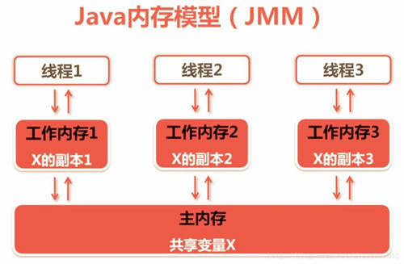

## 总览
* [多线程并发实践](https://juejin.im/post/59c4ba6f5188254f962cc934)

## [进程和线程之由来](http://www.cnblogs.com/dolphin0520/p/3910667.html)
* 进程让操作系统的并发性成为可能，而线程让进程的内部并发成为可能。
* 一个进程虽然包括多个线程，但是这些线程是共同享有进程占有的资源和地址空间的。进程是操作系统进行资源分配的基本单位，而线程是操作系统进行调度的基本单位。
* Java 中的多线程是抢占式的
## java 堆 和 栈
* [Java堆和栈看这篇就够](https://iamjohnnyzhuang.github.io/java/2016/07/12/Java%E5%A0%86%E5%92%8C%E6%A0%88%E7%9C%8B%E8%BF%99%E7%AF%87%E5%B0%B1%E5%A4%9F.html)
* [Java 堆内存](http://www.blogjava.net/fancydeepin/archive/2013/09/29/jvm_heep.html)
* [Java虚拟机的内存组成以及堆内存介绍](http://www.hollischuang.com/archives/80)
## [ Java内存管理](http://blog.csdn.net/u013142781/article/details/50830754)
## 实现线程的主要3种方式:
使用内核线程实现，使用用户线程实现，使用用户线程加轻量级进程混合实现。
[线程怎么来的](https://mp.weixin.qq.com/s/c_ylY1Iskng7nRFhRT2sKA)
## [Linux探秘之用户态与内核态](http://www.cnblogs.com/bakari/p/5520860.html)

## JMM
*   
 Java内存模型(Java Memory Model，JMM) 是对Java并发编程中线程与内存的关系的定义，即线程间的共享变量存储在主内存（Main Memory） 中，每个线程都有一个私有的本地工作内存（Local Memory），线程的本地内存中存储了该线程使用到的共享变量的副本（从主内存复制而来），线程对该变量的所有读/写操作都必须在自己的本地内存中进行，不同的线程之间也无法直接访问对方本地内存中的变量，线程间变量值的传递需要通过与主内存同步来完成。理解Java内存模型，对于编写正确的Java并发程序来说至关重要。  
[简单的土豆-基础概念&理论](http://www.jianshu.com/p/f4cdcc90290a)

* [java多线程-内存模型](https://mp.weixin.qq.com/s?__biz=MzI3MTQ1NzU2NA==&mid=2247483922&idx=1&sn=eec86f8487432f7ec33b9429c86b38c5&chksm=eac0ce61ddb747776eac465a32fec5f49bbcf9ecd24b555503d4bcd9e5d369fda85945bde19d&mpshare=1&scene=1&srcid=09232nbYtxYmu9O623W83M0s#rd)

## 线程状态转换
* 
[来源](https://my.oschina.net/mingdongcheng/blog/139263)

## syncronized
* 在Java里边就是拿到某个同步对象的锁（一个对象只有一把锁）；  
如果这个时候同步对象的锁被其他线程拿走了，他（这个线程）就只能等了（线程阻塞在锁池等待队列中）。   
取到锁后，他就开始执行同步代码(被synchronized修饰的代码）；  
线程执行完同步代码后马上就把锁还给同步对象，其他在锁池中等待的某个线程就可以拿到锁执行同步代码了。    
这样就保证了同步代码在统一时刻只有一个线程在执行。
* 在Java程序运行时环境中，JVM需要对两类线程共享的数据进行协调：  
1）保存在堆中的实例变量  
2）保存在方法区中的类变量  
这两类数据是被所有线程共享的。（程序不需要协调保存在Java 栈当中的数据。因为这些数据是属于拥有该栈的线程所私有的。）
* [参考，文中代码示例结果有误，需自己运行查看](http://www.importnew.com/20444.html)

## volatile
* 保证可见性: 保证了不同线程对这个变量进行操作时的可见性，即一个线程修改了某个变量的值，这新值对其他线程来说是立即可见的。

当一个共享变量被volatile修饰时，它会保证修改的值会立即被更新到主存，当有其他线程需要读取时，它会去内存中读取新值。  

而普通的共享变量不能保证可见性，因为普通共享变量被修改之后，什么时候被写入主存是不确定的，当其他线程去读取时，此时内存中可能还是原来的旧值，因此无法保证可见性。  

另外，通过synchronized和Lock也能够保证可见性，synchronized和Lock能保证同一时刻只有一个线程获取锁然后执行同步代码，并且在释放锁之前会将对变量的修改刷新到主存当中。因此可以保证可见性。

* 保证有序性  

1）当程序执行到volatile变量的读操作或者写操作时，在其前面的操作的更改肯定全部已经进行，且结果已经对后面的操作可见；在其后面的操作肯定还没有进行；

2）在进行指令优化时，不能将在对volatile变量的读操作或者写操作的语句放在其后面执行，也不能把volatile变量后面的语句放到其前面执行。

* 不能确保原子性  
自增操作不是原子性操作，volatile无法保证对变量的任何操作都是原子性的。  
java 中非原子操作：  
    1. 自增，自减，
    2. 变量赋值给变量
    3. new 对象实例
    4. 双目运算  

可以通过synchronized或lock，进行加锁，来保证操作的原子性。也可以通过AtomicInteger

* volatile的应用场景  
[参考](http://www.jianshu.com/p/7798161d7472)

## synchronized和volatile比较
1)关键字volatile是线程同步的轻量级实现，性能比synchronized好，且volatile只能修饰变量，synchronized可修饰方法和代码块。  
2)多线程访问volatile不会发生阻塞，synchronized会出现阻塞  
3)volatile能保证数据可见性，不保证原子性;synchronized可以保证原子性，也可以间接保证可见性，因为synchronized会将私有内存和公共内存中的数据做同步。  
4)volatile解决的是变量在多个线程间的可见性，synchronized解决的是多个线程访问资源的同步性。  
5）原子类:一个原子类型就是一个原子操作可用的类型，可在没有锁的情况下做到线程安全。但原子类也不是完全安全，虽然原子操作是安全的，可方法间的调用却不是原子的，需要用同步。  
[参考：java多线程核心技术梳理(附源码)](https://brianway.github.io/2016/04/18/javase-multithread-programming-reading-note/#线程间通信)
## 线程间通信1：wait 、notify
* [Java多线程之并发协作生产者消费者设计模式](http://blog.csdn.net/linglongxin24/article/details/52788774)
## 线程间通信2: lock 、Condition
* [Java多线程之并发协作生产者消费者设计模式JDK1.5.0+升级优化版](http://blog.csdn.net/linglongxin24/article/details/52803790)

## ThreadPoolExecutor 、BlockingQueue
* [线程池的介绍及使用](http://www.cnblogs.com/Seanisme/articles/6164126.html#undefined)

